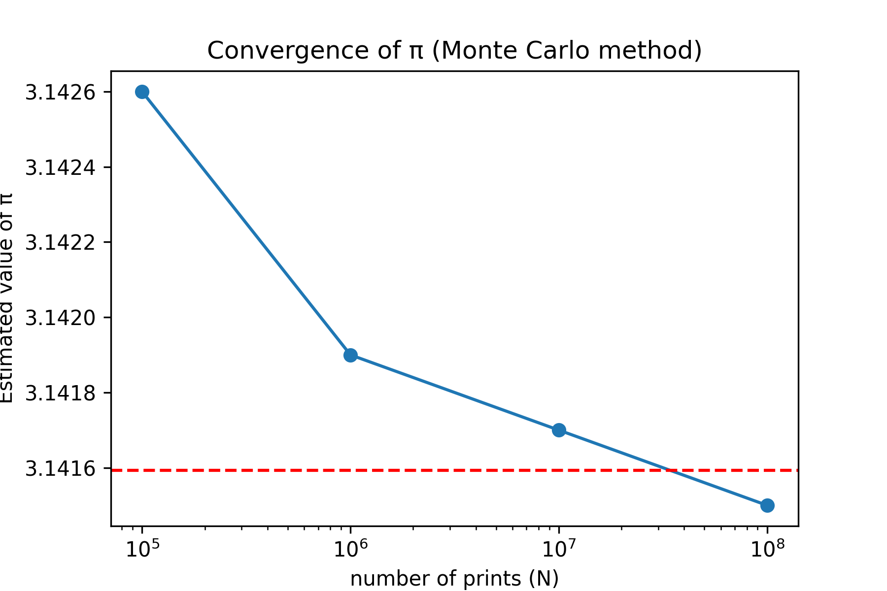

## 📖 Principle
Generate random points in the unit square [0,1]×[0,1] and count how many fall inside the quarter of a circle of radius 1.



\[
\pi \approx 4 \times \frac{\text{points in circle}}{\text{total points}}
\]

## ⚙️ Features
- Written in **C++17**
- Parallelized with **OpenMP**
- Uses **std::mt19937** random generator per thread (safe and independent)
- Measures **execution time** and **speedup**


## 🧮 Compilation & Execution

```bash
make
./montecarlo_pi
